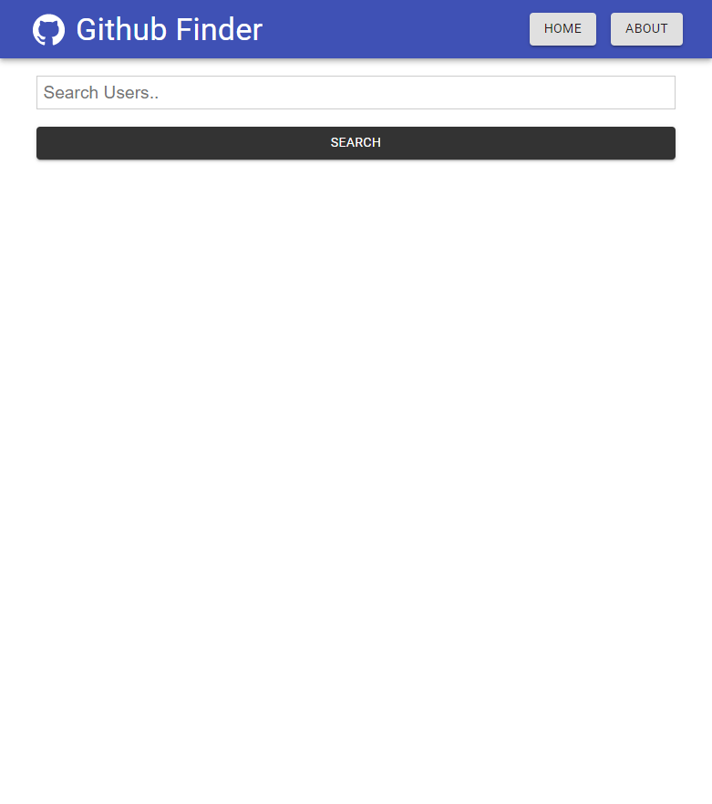

# Getting Started

This is a personal Project aimed to showcase my programming skills. In this project, an user can search any github profile, check the profile and their latest repositories (upto 5 repositories) as well as can visit the original github pages of their search results.

# Deployed to Netlify

Link: https://github-application.netlify.app/

## Available Scripts

In the project directory, you can run:

### `npm start`

Runs the app in the development mode.\
Open [http://localhost:3000](http://localhost:3000) to view it in the browser.

## Image of my Project

